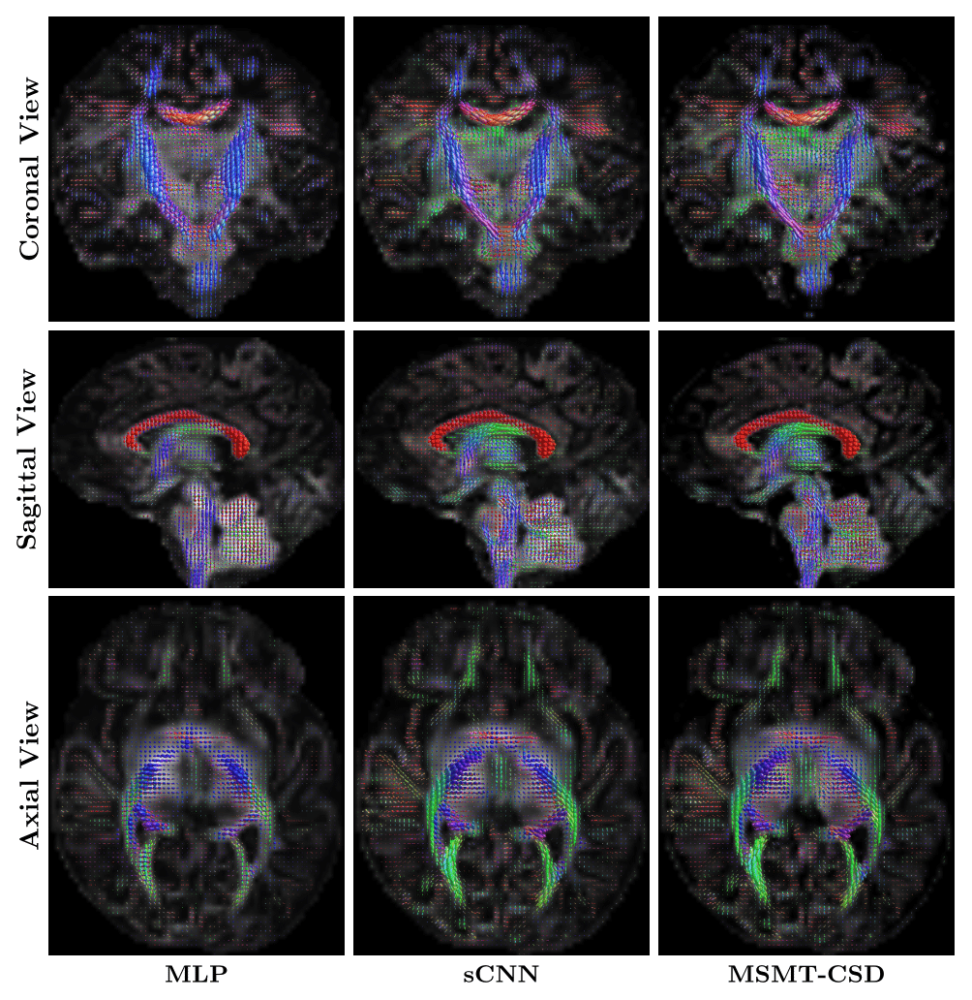
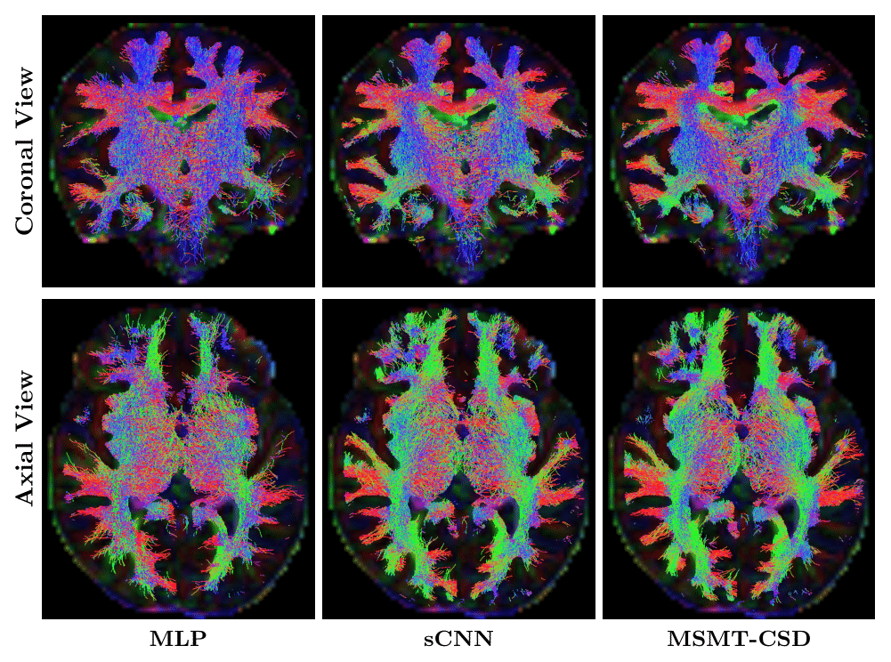

## Equivariant Spherical CNNs for Neonatal Diffusion MRI

This repository provides the official implementation of our paper:

> **Equivariant Spherical CNNs for Accurate Fiber Orientation Distribution Estimation in Neonatal Diffusion MRI with Reduced Acquisition Time**  
> *Haykel Snoussi and Davood Karimi*  
> Department of Radiology, Boston Children’s Hospital & Harvard Medical School  
> [arXiv:2504.01925](https://arxiv.org/abs/2504.01925)


### Summary

We introduce a geometric deep learning framework based on **rotationally equivariant Spherical CNNs (sCNNs)** to estimate **Fiber Orientation Distributions (FODs)** from neonatal diffusion MRI (dMRI), using **only 30% of the full diffusion acquisition protocol**. This approach enables faster and more practical neonatal imaging. The model was trained and evaluated on 43 neonatal dMRI datasets from the Developing Human Connectome Project (dHCP).

### Highlights
- Uses **only 30%** of the dHCP acquisition protocol — reducing scan time and motion artifacts.
- Employs **SO(3)-equivariant spherical convolutions** to preserve rotational symmetries of diffusion signals.
- Incorporates a **shell-attention mechanism** for adaptive fusion across b-value shells.
- Optimized with a **spatial-domain loss function** to prioritize perceptually meaningful FOD reconstructions.
- Delivers **superior tractography** compared to both standard MLP and MSMT-CSD methods.


### Method Overview


*Figure: Overview of the full data processing pipeline and sCNN architecture.*

---

### FOD Estimation Accuracy



*Figure: Comparison of FODs predicted by MLP, sCNN (30% data), and MSMT-CSD ground truth.*

---

### Tractography Analysis



*Figure: Tractography results using FODs from MLP, sCNN, and MSMT-CSD.*

---

### 📄 Citation

If you use this work, please cite:

```bibtex
@article{snoussi2025equivariant,
  title={Equivariant Spherical CNNs for Accurate Fiber Orientation Distribution Estimation in Neonatal Diffusion MRI with Reduced Acquisition Time},
  author={Snoussi, Haykel and Karimi, Davood},
  journal={arXiv preprint arXiv:2504.01925},
  year={2025}
}
